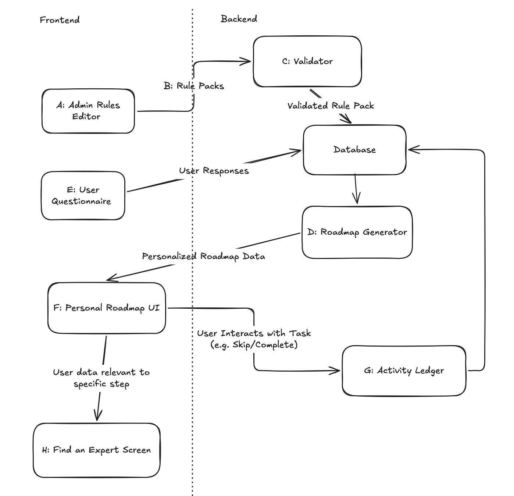
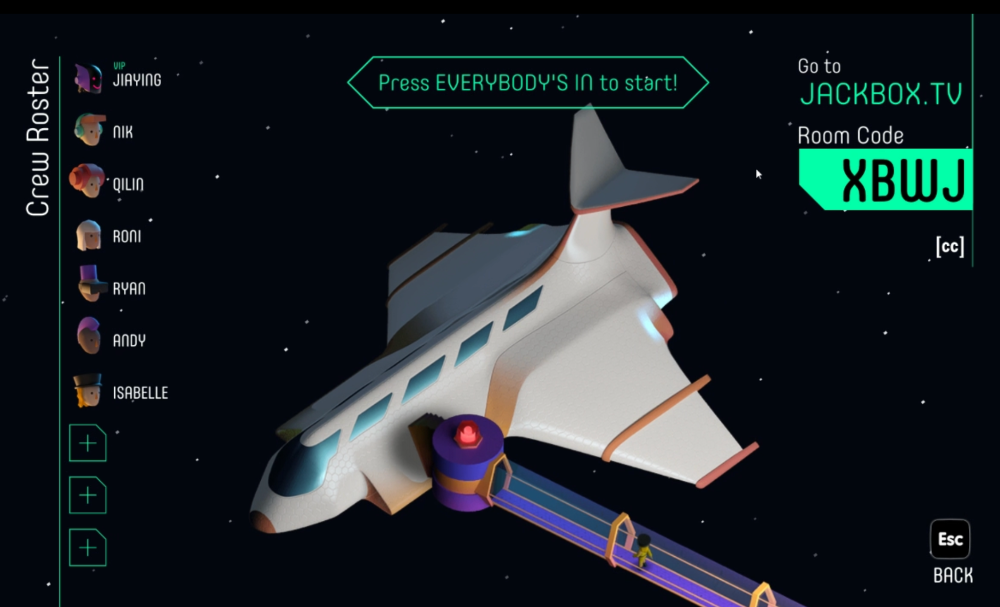
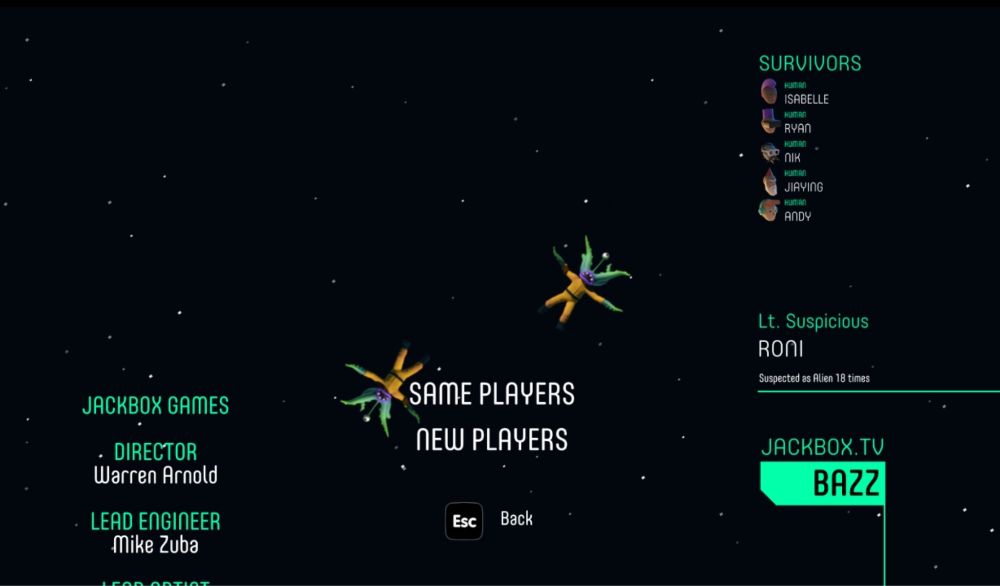
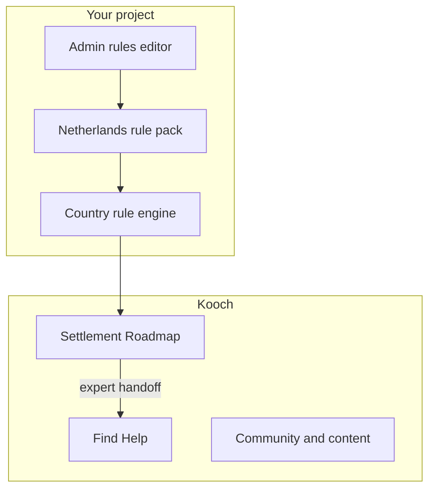
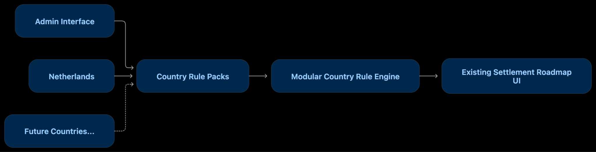

# Kooch/ Team 6 Team Banana
> _Note:_ This document will evolve throughout your project. You commit regularly to this file while working on the project (especially edits/additions/deletions to the _Highlights_ section).
 > **This document will serve as a master plan between your team, your partner and your TA.**

## Product Details

#### Q1: What is the product? Isabelle

We are building a web-based Settlement Roadmap and Country Rule Engine for Kooch, a platform that gives newcomers a personalized, step-by-step plan for settling in a new country, starting with the Netherlands and designed to support additional countries in the future.

The problem:
Moving to a new country involves many steps that depend on one another. What a newcomer needs to do, and in what order, depends on factors such as nationality and visa, and rules can change over time. Government sites explain one process at a time, so newcomers have to piece together information from outdated blogs and WhatsApp groups.

Kooch’s existing roadmap solves this problem in the Netherlands, but its rules are currently built into the application. Rule changes require a developer, and adding another country would require significant redevelopment.

Our partner:
Kooch ([lets.kooch.com](http://lets.kooch.com)) is an Amsterdam-based, early-stage platform for international newcomers. It provides:

- Settlement Roadmap: personalized guidance for administrative tasks
- Find Help: connections to professionals such as immigration lawyers
- Community: events and opportunities to build connections

Naz is Kooch’s founder, who leads product, design and content. Hossein is Kooch’s only developer.

What we are building:
Our web application has three main components:

1. Country Rule Packs:
   Editable country-specific rules describing what tasks are required, who they apply to, what must happen first, and when they are due. The MVP will include a complete, Kooch-reviewed Netherlands rule pack.
2. Personalized Roadmap:
   Newcomers answer questions about their city, visa, EU/non-EU status, arrival date, and purpose of stay. They receive only the tasks relevant to them, in the correct order, with blocked tasks and deadlines clearly explained. The roadmap supports English and Farsi and can connect users to relevant professionals through Find Help.
3. Admin Rules Editor:
   Kooch’s non-technical team can edit, preview, and publish rule changes without a developer. For example, if a government deadline changes, Kooch can update the rule without releasing new code.

#### Q2: Who are your target users? Isabelle

Our primary users are international newcomers settling in the Netherlands. The MVP focuses on four groups: skilled migrants, students, partner-permit holders, and EU citizens, in Amsterdam, Rotterdam, and Utrecht.

Primary users:
Priya, 20, skilled migrant:

- Priya is a software developer from India, living in Amsterdam on a highly skilled migrant permit
- Priya needs a personalized list showing what to do, in what order, and what is blocking the next step

Reza, 34, partner-permit holder:

- Reza is a Farsi-speaking newcomer from Iran with a Master’s degree and limited local support
- Reza needs clear guidance on which requirements apply to him and where to start, including Farsi support

Ayesha, 21, student:

- Ayesha is a Pakistani student at UvA with a limited budget and concerns about insurance and working while studying
- Ayesha needs a student-specific roadmap that removes irrelevant tasks and highlights important requirements and deadlines

Martha, 27, EU citizen

- Martha is a Polish designer moving to Rotterdam who finds the Dutch administrative system confusing despite having a simpler process
- Martha needs a short, relevant roadmap that excludes requirements that do not apply to EU citizens

Secondary users - Kooch administrators:
Noor, Content Lead, is a non-developer who manages Kooch’s content across English, Dutch, and Farsi. She needs to update rules, see which users are affected, preview changes, and publish them without relying on a developer.

Indirect users - Professionals
Fatima, an immigration lawyer on Find Help, benefits when newcomers are connected to professional support.

#### Q3: Why would your users choose your product? What are they using today to solve their problem/need? Jia Ying

**What newcomers use now:**

* Googling at 2am and landing on expat blogs from 2019
* Facebook and WhatsApp groups where advice is confident and wrong
* Government sites that are accurate but siloed, one agency at a time, and rarely explain order or dependencies
* The one friend who moved two years earlier and "thinks it was like that"

**Why the Kooch roadmap wins:**

* **Order, not just information.** Official sources tell you what a task is. Kooch tells you what to do next, and what you can't do yet.
* **Personal.** A student, an EU citizen and a skilled migrant get genuinely different roadmaps.
* **Deadlines you'd otherwise miss.** Some Dutch benefits and obligations have time windows starting from arrival or first employment. Missing them costs real money.
* **Accurate and maintained.** Rules are reviewed by Kooch and updatable the day they change.
* **Help at the right moment.** When a task gets risky, users are pointed to a professional instead of a Facebook thread.

**Why this matters to Kooch:** our mission is that settling in should be clear and humane. A rule engine is what lets us keep the Netherlands accurate today and take the same quality to other countries tomorrow.

> Short (1 - 2 min' read max)
 * We want you to "connect the dots" for us - Why does your product (as described in your answer to Q1) fits the needs of your users (as described in your answer to Q2)?
 * Explain the benefits of your product explicitly & clearly. For example:
    * Save users time (how and how much?)
    * Allow users to discover new information (which information? And, why couldn't they discover it before?)
    * Provide users with more accurate and/or informative data (what kind of data? Why is it useful to them?)
    * Does this application exist in another form? If so, how does your differ and provide value to the users?
    * How does this align with your partner's organization's values/mission/mandate?

#### Q4: What are the user stories that make up the Minimum Viable Product (MVP)?Jia Ying

As a
 * At least 5 user stories concerning the main features of the application - note that this can broken down further
 * You must follow proper user story format (as taught in lecture) `As a <user of the app>, I want to <do something in the app> in order to <accomplish some goal>`
 * User stories must contain acceptance criteria. Examples of user stories with different formats can be found here: https://www.justinmind.com/blog/user-story-examples/. **It is important that you provide a link to an artifact containing your user stories**.
 * If you have a partner, these must be reviewed and accepted by them. You need to include the evidence of partner approval (e.g., screenshot from email) or at least communication to the partner (e.g., email you sent)

**US1: Personal roadmap.** As a newcomer, I want to answer a short set of questions about my situation in order to get a roadmap that only includes tasks relevant to me.

* Intake asks for country, city, visa type, EU or non-EU nationality, arrival date and main purpose (work, study, partner)
* Generated roadmap excludes tasks whose conditions don't match the profile
* The same profile always generates the same roadmap

**US2: See what's blocked and why.** As a newcomer, I want to see which tasks I can't start yet and what's blocking them in order to stop wasting appointments I'm not eligible for.

* Blocked tasks are visually distinct from available ones
* Each blocked task names its prerequisite (e.g. "Needs your citizen number first")
* Completing a prerequisite unlocks dependent tasks immediately

**US3: Deadlines from my arrival date.** As a newcomer, I want to see when each task is due based on my arrival date in order to avoid missing time-limited deadlines.

* Due dates are computed from the rule's offset and the user's arrival or start date
* Tasks due soon are highlighted
* Tasks past their window show clear, calm guidance on what to do now

**US4: Admin edits a rule.** As a Kooch content lead, I want to edit a rule in an admin interface in order to update the roadmap when Dutch rules change, without asking a developer.

* Admins can edit task text (in every active language, MVP: English and Farsi), conditions, dependencies and deadline offsets
* Invalid rules (e.g. circular dependencies, missing translations) are rejected with a clear message
* Changes are saved as a new version, previous versions are kept

**US5: Preview before publishing.** As a Kooch content lead, I want to preview how a rule change affects sample user profiles in order to publish changes with confidence.

* Admins can run a draft rule pack against a set of test profiles
* The preview shows which tasks were added, removed or changed per profile
* Nothing reaches users until the version is published

**US6: Expert handoff.** As a newcomer, I want tasks that often go wrong to offer me a professional in order to get help before a problem becomes a crisis.

* Rules can carry an expert category (e.g. immigration law, housing, tax)
* Flagged tasks show a "Get help" link to the matching Find Help category
* The link carries context (which task) without exposing unnecessary personal data

**US7: Multilingual roadmap.** As a Farsi-speaking newcomer, I want to read my roadmap in Farsi in order to understand it without translating everything myself.

* Users can switch between English and Farsi (MVP)
* Farsi renders correctly right-to-left, including mixed text and dates
* A rule pack can't be published with missing translations
* Languages are a list in the rule pack, never hardcoded: adding Dutch, Arabic or Kurdish later needs no code change

**Stretch: US8: Second country proof.** As Kooch, we want a small draft rule pack for a second country in order to prove the engine is country-agnostic.

* A partial pack (5 to 10 tasks) for one other country runs through the same engine with zero code changes

#### Q5: Have you decided on how you will build it? Share what you know now or tell us the options you are considering.

> Short (1-2 min' read max)
 * What is the technology stack? Specify languages, frameworks, libraries, PaaS products or tools to be used or being considered.
 * How will you deploy the application?
 * Describe the architecture - what are the high level components or patterns you will use? Diagrams are useful here.
 * Will you be using third party applications or APIs? If so, what are they?

Tech Stack:

* Next.js with TypeScript
* Prisma & PostgreSQL for the database layer
* Sentry for error monitoring
* Resend for email notifications

The project will be deployed with Vercel, with preview deployments per pull request. No third party applications or APIs are planned for the MVP.

Rough architecture / components of the project:

A: Admin rules editor - A screen where someone from the content team can edit rule packs modularly without changing code.
B: Rule packs - Versioned data, with one pack per country. They contain the rules for generating roadmaps based on user profiles and the country rules. They are stored in the database, and can be exported into a readable JSON format for easy review.
C: Validator - An object/function which checks whether rule packs are valid before they can be published. It checks things like structure, whether there are dependency cycles, missing translations, broken references, etc…
D: Roadmap Generator - An object/function which takes the user responses as well as a specified rule pack version to output a personal roadmap for the user. It should be deterministic, so it should not rely on AI or randomness.
E: User Questionnaire - A screen where users can answer a list of questions which will be used for determining their personal roadmap.
F: Personal Roadmap UI - A screen that takes the output from D (the raw data for the roadmap), and makes it readable and pretty for the user.
G: Activity Ledger - An object that records what users do (completed, skipped, reopened). Task state is derived from it, never overwritten. Append only.
H: Find Help Categories - From F, the roadmap UI, users can click a find help button for that specific task. It will go to a screen where the user can request help from an expert.

The design will be modular, where we never hardcode rules for a specific country.

----
## Intellectual Property Confidentiality Agreement
> Note this section is **not marked** but must be completed briefly if you have a partner. If you have any questions, please ask on Piazza.
>
**By default, you own any work that you do as part of your coursework.** However, some partners may want you to keep the project confidential after the course is complete. As part of your first deliverable, you should discuss and agree upon an option with your partner. Examples include:
1. You can share the software and the code freely with anyone with or without a license, regardless of domain, for any use.
2. You can upload the code to GitHub or other similar publicly available domains.
3. You will only share the code under an open-source license with the partner but agree to not distribute it in any way to any other entity or individual.
4. You will share the code under an open-source license and distribute it as you wish but only the partner can access the system deployed during the course.
5. You will only reference the work you did in your resume, interviews, etc. You agree to not share the code or software in any capacity with anyone unless your partner has agreed to it.

**Your partner cannot ask you to sign any legal agreements or documents pertaining to non-disclosure, confidentiality, IP ownership, etc.**

Briefly describe which option you have agreed to.

----

## Teamwork Details

#### Q6: Have you met with your team?

Do a team-building activity in-person or online. This can be playing an online game, meeting for bubble tea, lunch, or any other activity you all enjoy.
* Get to know each other on a more personal level.
* Provide a few sentences on what you did and share a picture or other evidence of your team building activity.
* Share at least three fun facts from members of your team (total not 3 for each member).

Fun facts:

1. Roni is born on the last day of the year, December 31st
2. Jia Ying has pink hair
3. Ryan can play 3 instruments: guitar, saxophone, and piano

#### Q7: What are the roles & responsibilities on the team?

Describe the different roles on the team and the responsibilities associated with each role (e.g., frontend, database).
 * Roles should reflect the structure of your team and be appropriate for your project. One person may have multiple roles.
 * Add role(s) to your Team-[Team_Number]-[Team_Name].csv file on the main folder.
 * At least one person must be identified as the dedicated partner liaison. They need to have great organization and communication skills.
 * Everyone must contribute to code. Students who don't contribute to code enough will receive a lower mark at the end of the term.

List each team member and:
 * A description of their role(s) and responsibilities including the components they'll work on and non-software related work
 * Why did you choose them to take that role? Specify if they are interested in learning that part, experienced in it, or any other reasons. Do no make things up. This part is not graded but may be reviewed later.

All members chose their roles based on interest, and since there were no conflicting choices, we decided to use those roles. We also understand the roles are flexible, and we can help each other out on various portions of the project.

Our current team responsibilities are:

* **Roni – Team Coordinator/Scrum Master:** organizes internal meetings, facilitates sprint planning, and monitors the team’s overall progress.
* **Stephen – Primary Kooch Liaison and Roadmap UI Developer:** communicates with the partner and TA, prepares partner meeting agendas and minutes, and contributes to the user-facing roadmap, intake flow, multilingual support, and right-to-left layout.
* **Nikolos – Backup Kooch Liaison and Admin Editor Lead:** supports partner communication and works on the rule editor and preview functionality.
* **Isabelle – Engine Lead:** works on the rule-pack format, rule validation, and roadmap generation logic, with support from Roni.
* **Andy – Roadmap UI and QA Developer:** contributes to the roadmap interface, intake flow, multilingual and right-to-left support, as well as testing.
* **Jia Ying – Rule Content Lead:** researches official Netherlands settlement information and prepares the initial Netherlands rule pack for Kooch’s review.
* **Ryan – QA and Testing Lead:** prepares test profiles, automated tests for the rules engine, and the release checklist.

#### Q8: How will you work as a team?

Our team will hold a recurring internal meeting every Thursday from 6:30 p.m. to 7:30 p.m., following our tutorial. The meeting will take place online through Zoom. Its purpose is to review our progress, discuss blockers, update the GitHub Project board, assign upcoming tasks, and prepare questions for our partner or TA.

Additional meetings, coding sessions, and code reviews will be arranged when needed. Team members may also schedule smaller meetings to work together on related user stories or technical components.

We will communicate with our partner through WhatsApp and hold partner meetings online. Partner meetings will be scheduled as needed when we require clarification, feedback, or approval, rather than following a fixed weekly schedule. Stephen will be the primary Kooch liaison, and Nikolos will serve as the backup contact. Stephen will collect the team’s questions, prepare meeting agendas, and maintain the partner meeting minutes.

Before the D1 deadline, we will hold two partner meetings:

1. **First partner meeting:** We discussed the project goals, the existing Kooch codebase, the proposed user stories, the configurable country-independent rules engine, the preferred technology stack, and the initial MVP.
2. **Second partner meeting:** We have proposed Tuesday, September 29, between 3:00 p.m. and 5:00 p.m. Toronto time. During this meeting, we plan to confirm the MVP and user stories, receive feedback on our proposed architecture and mockup, clarify the repository arrangement, and obtain the partner’s written approval for the D1 plan. Stephen will prepare the agenda and minutes, with Nikolos acting as backup.

Our current team responsibilities are:

* **Roni – Team Coordinator/Scrum Master:** organizes internal meetings, facilitates sprint planning, and monitors the team’s overall progress.
* **Stephen – Primary Kooch Liaison and Roadmap UI Developer:** communicates with the partner and TA, prepares partner meeting agendas and minutes, and contributes to the user-facing roadmap, intake flow, multilingual support, and right-to-left layout.
* **Nikolos – Backup Kooch Liaison and Admin Editor Lead:** supports partner communication and works on the rule editor and preview functionality.
* **Isabelle – Engine Lead:** works on the rule-pack format, rule validation, and roadmap generation logic, with support from Roni.
* **Andy – Roadmap UI and QA Developer:** contributes to the roadmap interface, intake flow, multilingual and right-to-left support, as well as testing.
* **Jia Ying – Rule Content Lead:** researches official Netherlands settlement information and prepares the initial Netherlands rule pack for Kooch’s review.
* **Ryan – QA and Testing Lead:** prepares test profiles, automated tests for the rules engine, and the release checklist.

These roles identify areas of primary ownership rather than strict boundaries. All members are expected to contribute code, tests, documentation, reviews, and technical discussions.

#### Q9: How will you organize your team?
We will use **GitHub Projects** as our main task-management system. Our TA and partner will be given access so that they can review the status of our work. The board will contain the following workflow states:

* **Backlog:** tasks that have been identified but are not ready to begin.
* **Ready:** clearly defined tasks that can be selected or assigned.
* **In Progress:** tasks currently being implemented.
* **In Review:** completed work that is waiting for pull request review.
* **Done:** work that has been reviewed, merged, and completed.

Each task will be represented by a GitHub Issue whenever possible. An Issue will include a clear description, an owner, relevant acceptance criteria, and links to the corresponding user story or pull request. Larger tasks will be divided into smaller Issues so that their progress can be tracked clearly.

Tasks will be assigned through a combination of volunteering and team discussion. Members may volunteer for work related to their interests or primary roles. If necessary, the team will assign tasks based on current workload, relevant experience, dependencies, and the needs of the sprint. Every task must have one clearly identified primary owner.

Tasks will be selected according to MVP importance, technical dependencies, partner feedback, deadlines, and whether another team member is blocked by the work. We will not rely on priority labels; instead, task order will be agreed upon during sprint planning and reflected by the order and status of items on the GitHub Project board.

A task is considered complete only when:

1. Its acceptance criteria have been satisfied.
2. The implementation and appropriate tests have been completed.
3. A pull request has been opened and linked to the relevant Issue.
4. At least one team member other than the author has reviewed and approved the pull request.
5. Any required automated checks have passed.
6. The author has merged the pull request and moved the task to **Done**.

We will also maintain the following organizational artifacts:

* GitHub Project board and GitHub Issues
* Pull requests and code-review records
* Partner and internal meeting agendas and minutes
* Team member and stakeholder files
* Interactive mockups
* Technical documentation and decision records
* The repository README
* Release and testing checklists

Important technical decisions will be recorded in GitHub Issues, pull requests, meeting minutes, or another appropriate document in the repository.

#### Q10: What are the rules regarding how your team works?
**Communication**

The team will use Instagram as its primary internal communication channel. Members are expected to respond to team messages within 24 hours. Urgent matters should be clearly identified in the message.

We will communicate with our partner through WhatsApp. Stephen will act as the primary partner contact, while Nikolos will serve as the backup. Team questions will be collected and combined before being sent to the partner whenever possible, so that communication remains clear and organized.

Internal and partner meetings will be held online. Team members are expected to attend scheduled meetings. If a member cannot attend, they must notify the team at least one day in advance and review the meeting minutes afterward.

**Task completion and accountability**

Each task must have a primary owner and be tracked on the GitHub Project board. Members are responsible for keeping the status of their assigned Issues current.

If a member expects that they will not complete a task by its deadline, they must notify the team at least two days in advance. The team will discuss whether the task should be adjusted, divided, reassigned, or supported by another member.

If a member does not respond for three days without prior notice, the team will attempt to contact them directly. If the member remains unresponsive or repeatedly fails to contribute, the team will document the issue and contact the mentor TA for guidance.

Meeting attendance, task completion, pull requests, code reviews, tests, documentation, and GitHub Project activity will be used to maintain transparency and accountability.

**Code collaboration**

Development work will be completed on separate branches and submitted through pull requests. Every pull request must be reviewed and approved by at least one team member who is not the author. The author may merge their own pull request only after the required review has been completed and all necessary checks have passed.

All members are expected to follow the team’s agreed coding standards, write appropriate tests, document significant changes, and review other members’ work. Major technical decisions should be discussed with the team and documented before implementation whenever possible.

The team has discussed and agreed to follow the communication, collaboration, review, and accountability processes described above.

## Organisation Details

#### Q11. How does your team fit within the overall team organisation of the partner?
* Given the team structure of your partner, what role do you think your team will play?
* Examples include product development that includes developing new features, or quality assurance that includes developing features that test the product reliability, or software maintenance that includes fixing crucial bugs in the product.
* Provide examples of why you think you fit this role.

#### Q12. How does your project fit within the overall product from the partner?
* Look at the big picture of the product and think about how your project fits into this product.
* Is your project the first step towards building this product? Is it the first prototype? Are you developing the frontend of a product whose backend is developed by the partner? Are you building the release pipelines for a product that is developed by the partner? Are you building a core feature set and take full ownership of these features?
* You should also provide details of who else is contributing to what parts of the product, if you have this information. This is more important if the project that you will be working on has strong coupling with parts that will be contributed to by members other than your team (e.g., from a partner).
* You can be creative for these questions and even use a graphical or pictorial representation to demonstrate the fit.
* Briefly specify what your partner considers a success for this project. Do they want you to build specific features? Publish a usable product? Just a prototype? Be as specific as you can be at this point.

## Organization Details
**Q11:**
Kooch is a small team:

- **Naz:** founder, product, design, content. Your main partner contact.
- **Hossein:** primary developer, owns the core platform and the current roadmap.

For this term, our student team will operate as Kooch's full-stack development team for the roadmap engine. This means that we’ll be doing a combination of developing new features, testing and validating existing implementations, and ensuring that new and existing systems work smoothly together.

We’ll be building a new core system the rest of Kooch will depend on as they expand. As of Deliverable 1, we plan to build a modular foundation that separates country-specific settlement rules from the core roadmap system, allowing Kooch to support additional countries without rebuilding the product for each country. This will be a core system that other parts of Kooch will depend on as the platform expands. Our work will span the roadmap's database, backend, and frontend architecture and will integrate with Kooch's existing platform and UI rather than replacing it entirely.

**Q12:**

Below is a visual example:

Kooch already has an existing Settlement Roadmap with much of the user-facing UI and basic roadmap logic implemented. Our project’s current main goal is to help redesign the country-specific logic underlying the roadmap to make it modular, particularly by separating country-specific settlement and immigration rules from the core roadmap system. Existing components such as the roadmap UI and user accounts will remain in place and will integrate with the new modular system.

Currently, much of the roadmap logic has been designed around the Netherlands. However, settlement requirements differ significantly between countries. As Kooch expands, implementing each new country through country-specific, hardcoded logic in the core application would make the system increasingly difficult to maintain.

We also plan to develop some sort of admin page or interface for managing and adding new countries using the modular components. This will allow Kooch administrators to manage and modify existing country rules and add new countries and their requirements quickly and easily through the platform. For example, an administrator could add the United States and configure its settlement requirements, while the same underlying roadmap engine uses those rules to generate the appropriate roadmap for users.

Because we are modifying part of an existing product, our work will need to integrate with Kooch's existing onboarding, user profiles, roadmap UI, authentication, activity tracking, and other shared systems rather than replacing them. Changes to shared components will also need to be coordinated with Hossein to ensure that the new modular system works correctly with the existing platform.

Kooch has also mentioned that they are open to suggestions and improvements to the existing product as we work with it and learn more about how it works. Later on, we may work on new features or make smaller changes to improve the user experience, especially if we find parts of the product that are confusing or not very intuitive. These are not part of our main scope right now, but we can discuss and add them with Kooch as the project progresses.

## Potential Risks

#### Q13. What are some potential risks to your project?
**Scope and Technical Risks:**
The project includes a configurable rules engine, an admin editor, a personalized roadmap, multilingual support, and testing. The scope may become too large for one semester. In addition, the existing code may contain Netherlands-specific rules, dependencies, deadlines, and database structures, making it difficult to support other countries.

**Content and Regression Risks:**
Immigration information may become inaccurate or outdated, which could mislead users. Refactoring the roadmap may also break existing task eligibility, ordering, deadlines, dependencies, or saved user progress.

**Coordination and Integration Risks:**
Delayed partner decisions, unclear repository procedures, and different assumptions between team members may block development. The engine, admin editor, roadmap UI, rule content, and tests may also fail to integrate correctly.

#### Q14. What are some potential mitigation strategies for the risks you identified?

We will define a clear MVP and treat additional features as stretch goals. Before making major changes, we will examine the existing code and create a small proof of concept. We will use official sources reviewed by Kooch, add regression tests, document important decisions, assign clear owners and deadlines, and integrate frequently through small pull requests.
